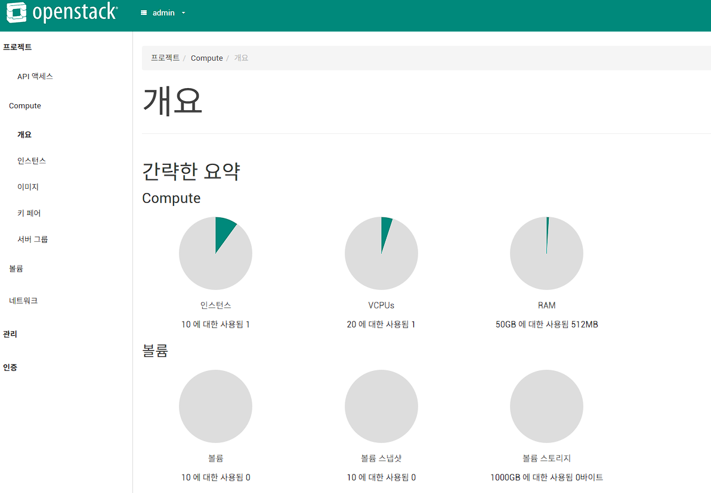

## 0. VMware Workstation VM 기반 OpenStack 실습 환경 구성 (Ansible 없이)

이 섹션은 Ansible 없이 **VMware Workstation VM을 직접 구성**해 OpenStack 실습 환경을 만드는 단계별 가이드입니다.
Ansible 자동화 강의 이전에 인프라 기반을 수동으로 이해하고 싶은 분을 위한 선행 실습입니다.

---

### 0.1 실습 목표
- VMware Workstation에서 Controller + Compute 노드 VM 2대를 구성한다.
- 노드 간 내부 네트워크(관리망/데이터망)와 외부 접근용 NAT 네트워크를 분리한다.
- Ubuntu 24.04 기반으로 OpenStack 핵심 서비스(Keystone/Glance/Nova/Neutron/Cinder/Horizon)를 수동 설치한다.
- Horizon 대시보드와 CLI로 VM 인스턴스를 생성해 동작을 확인한다.

---

### 0.2 호스트 PC 최소 요구 사항

| 항목 | 최소 | 권장 |
|---|---|---|
| RAM | 16 GB | 32 GB |
| vCPU | 4코어 | 8코어 이상 |
| 디스크 여유 | 100 GB | 200 GB (SSD) |
| OS | Windows 10/11 64-bit | Windows 11 |
| 소프트웨어 | VMware Workstation Pro 17+ | 동일 |

> **Intel VT-x / AMD-V 가상화 기능이 BIOS에서 활성화**되어 있어야 합니다.
> VMware Workstation에서 `VM 설정 → 프로세서 → 가상화 Intel VT-x/EPT 또는 AMD-V/RVI 사용`을 체크하세요.

---

### 0.3 VM 구성 설계

```
┌─────────────────────────────────────────────────────────┐
│                    Host PC (Windows)                    │
│                                                         │
│  ┌──────────────────────┐  ┌──────────────────────────┐ │
│  │  controller-node     │  │  compute-node            │ │
│  │  Ubuntu 24.04        │  │  Ubuntu 24.04            │ │
│  │  vCPU: 4 / RAM: 8GB  │  │  vCPU: 4 / RAM: 6GB     │ │
│  │  Disk: 60GB          │  │  Disk: 40GB              │ │
│  │                      │  │                          │ │
│  │  eth0 (NAT)          │  │  eth0 (NAT)              │ │
│  │  192.168.x.x         │  │  192.168.x.x             │ │
│  │                      │  │                          │ │
│  │  eth1 (Host-Only)    │──│  eth1 (Host-Only)        │ │
│  │  10.0.0.11/24        │  │  10.0.0.21/24            │ │
│  │  [관리망 + API]      │  │  [관리망]                │ │
│  │                      │  │                          │ │
│  │  eth2 (Host-Only)    │──│  eth2 (Host-Only)        │ │
│  │  10.0.1.11/24        │  │  10.0.1.21/24            │ │
│  │  [데이터/터널망]     │  │  [데이터/터널망]         │ │
│  └──────────────────────┘  └──────────────────────────┘ │
└─────────────────────────────────────────────────────────┘
```

| 노드 | 역할 | OpenStack 서비스 |
|---|---|---|
| controller-node | 관리·API | Keystone, Glance, Nova(API), Neutron(Server), Cinder(API), Horizon, MariaDB, RabbitMQ, Memcached |
| compute-node | 컴퓨트 | Nova(Compute), Neutron(OVS Agent) |

---

### 0.4 VMware Workstation 네트워크 설정

VMware `Edit → Virtual Network Editor`에서 가상 네트워크 두 개를 추가합니다.

| VMnet | 유형 | 서브넷 | 용도 |
|---|---|---|---|
| VMnet0 | NAT (기본값) | 자동 할당 | 인터넷 접속 (패키지 설치용) |
| VMnet2 | Host-Only | 10.0.0.0/24 | 관리망 · API 엔드포인트 |
| VMnet3 | Host-Only | 10.0.1.0/24 | VM 인스턴스 터널(Neutron VXLAN) |

> Host-Only 네트워크는 **DHCP를 비활성화**하고 고정 IP를 직접 부여합니다.

---

### 0.5 VM 생성 절차 (공통)

1. `파일 → 새 가상 머신 → 일반(Typical)` 선택
2. ISO 경로: `ubuntu-24.04.x-live-server-amd64.iso`
3. vCPU·RAM·디스크 크기는 [0.3 표](#03-vm-구성-설계) 참고
4. 네트워크 어댑터:
   - 어댑터 1 → NAT (VMnet0)
   - `어댑터 추가 → Host-Only → VMnet2`
   - `어댑터 추가 → Host-Only → VMnet3`
5. Ubuntu 설치 완료 후 SSH Server 활성화 확인

---

# AWS vs OpenStack 리소스 비교 가이드

본 문서는 퍼블릭 클라우드의 대표 주자인 **AWS (Amazon Web Services)**와 프라이빗 클라우드의 표준인 **OpenStack**의 핵심 리소스를 비교하여, 클라우드 아키텍처 및 서비스 매핑을 쉽게 이해할 수 있도록 돕기 위해 작성되었습니다.

---

## 1. 핵심 리소스 매핑 총괄표

| 리소스 분류 | **AWS (Amazon Web Services)** | **OpenStack** | 주요 역할 및 설명 |
| :--- | :--- | :--- | :--- |
| **컴퓨트 (Compute)** | **EC2** (Elastic Compute Cloud) | **Nova** | 가상 서버(인스턴스)를 생성하고 라이프사이클을 관리 |
| **블록 스토리지** | **EBS** (Elastic Block Store) | **Cinder** | 가상 서버에 탈부착하는 고성능/영구적 디스크 볼륨 |
| **오브젝트 스토리지** | **S3** (Simple Storage Service) | **Swift** / **Ceph** | 대용량 파일, 이미지, 백업 데이터를 저장하는 객체 기반 스토리지 |
| **네트워크 (Network)** | **VPC** (Virtual Private Cloud) | **Neutron** | 가상 네트워크, 서브넷, 라우터, IP(Floating IP) 관리 |
| **이미지 관리** | **AMI** (Amazon Machine Image) | **Glance** | 가상 서버 생성에 사용되는 OS 템플릿/이미지 저장 및 관리 |
| **인증 및 권한** | **IAM** (Identity & Access Management) | **Keystone** | 사용자 인증, API 토큰 발급, 리소스 접근 권한(RBAC) 관리 |
| **오케스트레이션** | **CloudFormation** | **Heat** | 템플릿 코드(YAML/JSON)를 기반으로 인프라 자동 배포 |
| **대시보드 (GUI)** | **AWS Management Console** | **Horizon** | 웹 브라우저 기반으로 리소스를 시각적으로 관리하는 GUI |
| **로드 밸런서** | **ELB** (Elastic Load Balancing) | **Octavia** (또는 LBaaS) | 부하 분산을 위해 트래픽을 여러 인스턴스로 라우팅 |
| **데이터베이스** | **RDS** (Relational Database Service) | **Trove** | 관계형 데이터베이스(DB) 엔진을 서비스 형태로 제공 |
| **비밀번호 관리** | **Secrets Manager** / **KMS** | **Barbican** | 인증서, 암호화 키, 비밀번호 등의 민감한 데이터를 안전하게 저장 |

---

## 2. 주요 아키텍처 및 개념 차이점

두 플랫폼은 서비스 영역(Public vs Private)의 특성상 유사한 리소스 구조를 가지면서도 운영 방식에서 차이점을 보입니다.

### ① 컴퓨트 및 이미지 서비스
* **AWS EC2 & AMI:** AWS가 사전에 최적화하여 제공하는 다양한 인스턴스 타입(T, M, C, R 시리즈 등)과 AMI 시장(AWS Marketplace)을 활용합니다.
* **OpenStack Nova & Glance:** 사용자가 직접 하이퍼바이저(KVM, QEMU 등)를 구성할 수 있으며, Glance에 원본 ISO나 QCOW2, RAW 포맷의 이미지를 직접 업로드하여 Flavor(CPU/Memory 규격)를 설정하고 배포합니다.

### ② 가상 네트워크 환경
* **AWS VPC:** 서브넷, 인터넷 게이트웨이(IGW), NAT 게이트웨이가 AWS 인프라 내부의 논리적 레이어에서 완전히 추상화되어 작동합니다.
* **OpenStack Neutron:** 물리 스위치 및 라우터 인프라와 플러그인(ML2/OVS, OVN 등)을 통해 연동됩니다. 실제 사설 IP(Fixed IP)와 외부 통신을 위한 공인 IP(Floating IP)의 매핑 개념이 더욱 명확하게 구분됩니다.

### ③ 멀티테넌시와 권한 체계
* **AWS IAM:** AWS Account(계정)를 최상위 경계로 두고, 하위에 User, Group, Role, Policy를 설정합니다. 조직 관리를 위해 AWS Organizations를 사용합니다.
* **OpenStack Keystone:** **Project (또는 Tenant)**가 리소스 분할의 중심입니다. 특정 Project 내에서 Compute, Network, Storage 등의 리소스 쿼터(Quota, 할당량)가 지정되며, 사용자는 도메인-프로젝트-역할 관계에 따라 접근 권한을 얻습니다.

### ④ 스토리지 생태계
* **AWS S3/EBS:** 완전히 관리형 서비스로 제공되며, 사용자는 성능 옵션(gp3, io2 등)만 선택하면 됩니다.
* **OpenStack 스토리지:** OpenStack 기본 내장 모듈은 Cinder와 Swift이지만, 실제 상용/엔터프라이즈 환경에서는 오픈소스 분산 스토리지인 **Ceph**를 백엔드로 연동하여 Cinder(블록)와 Swift API(오브젝트)를 통합 처리하는 아키텍처가 사실상 표준(De-facto standard)으로 사용됩니다.

---

### 0.6 OS 기본 설정 (두 노드 공통)

```bash
# 패키지 업데이트
sudo apt update && sudo apt upgrade -y

# 필수 도구 설치
sudo apt install -y curl wget git vim net-tools chrony

# 호스트명 설정 (controller-node 예시)
sudo hostnamectl set-hostname controller-node

# /etc/hosts 편집 (두 노드 모두)
sudo tee -a /etc/hosts <<'EOF'
10.0.0.11  controller-node
10.0.0.21  compute-node
EOF
```

고정 IP 설정 (`/etc/netplan/00-installer-config.yaml` 예시, controller-node):

```yaml
network:
  version: 2
  ethernets:
    eth0:                        # NAT — DHCP 유지
      dhcp4: true
    eth1:                        # 관리망
      dhcp4: false
      addresses: [10.0.0.11/24]
    eth2:                        # 터널망
      dhcp4: false
      addresses: [10.0.1.11/24]
```

```bash
sudo netplan apply
```

---

### 0.7 OpenStack 수동 설치 순서 (controller-node)

아래 순서로 서비스를 설치합니다. 각 단계는 공식 [OpenStack Installation Guide (Ubuntu)](https://docs.openstack.org/install-guide/) 기반입니다.

#### ① 사전 서비스 설치

```bash
# MariaDB
sudo apt install -y mariadb-server python3-pymysql
sudo mysql_secure_installation

# RabbitMQ
sudo apt install -y rabbitmq-server
sudo rabbitmqctl add_user openstack RABBIT_PASS
sudo rabbitmqctl set_permissions openstack ".*" ".*" ".*"

# Memcached
sudo apt install -y memcached python3-memcache
sudo sed -i 's/127.0.0.1/10.0.0.11/' /etc/memcached.conf
sudo systemctl restart memcached

# Etcd
sudo apt install -y etcd-client etcd-server
```

#### ② Keystone (인증)

```bash
# DB 생성
sudo mysql -e "CREATE DATABASE keystone;"
sudo mysql -e "GRANT ALL ON keystone.* TO 'keystone'@'%' IDENTIFIED BY 'KEYSTONE_DBPASS';"

# 패키지 설치 및 설정
sudo apt install -y keystone
sudo vi /etc/keystone/keystone.conf   # connection, provider 항목 수정
sudo keystone-manage db_sync
sudo keystone-manage fernet_setup
sudo keystone-manage bootstrap \
  --bootstrap-password ADMIN_PASS \
  --bootstrap-admin-url http://controller-node:5000/v3/ \
  --bootstrap-internal-url http://controller-node:5000/v3/ \
  --bootstrap-public-url http://controller-node:5000/v3/ \
  --bootstrap-region-id RegionOne
```

#### ③ Glance → Nova → Neutron → Cinder → Horizon 순 설치

각 서비스 설치 순서:

```text
Glance   → apt install glance        → DB 생성 → conf 수정 → db_sync → service 재시작
Nova     → apt install nova-api ...  → DB 생성 → conf 수정 → db_sync → cell 등록
Neutron  → apt install neutron-...   → DB 생성 → conf 수정 → db_sync → OVS 설정
Cinder   → apt install cinder-api   → DB 생성 → conf 수정 → db_sync
Horizon  → apt install openstack-dashboard → apache2 재시작
```

---

#### 설치 중 모니터링

ubuntu@controller-node:~$ cat ./openstack_dashboard.md
# 🚀 OpenStack 설치 상태 대시보드

업데이트 시간: 2026-06-08 01:48:21

- [x] keystone ✅ 설치됨
- [x] glance ✅ 설치됨
- [x] nova ✅ 설치됨
- [x] neutron ✅ 설치됨
- [x] placement ✅ 설치됨

---

# 🖥️ 내 환경에서 OpenStack VM 실행 구조

## 📋 환경 개요
- **호스트**: Windows PC
- **가상화 플랫폼**: VMware Workstation/Player
- **게스트 OS**: Ubuntu VM (여기에 OpenStack 설치)
- **OpenStack 서비스**: Control Node + Compute Node 역할을 동시에 수행
- **대시보드**: Horizon
- **인스턴스 이미지**: Ubuntu 22.04 LTS Cloud Image

---

## ⚙️ 실행 구조
1. Windows PC 위에 VMware로 Ubuntu VM을 실행
2. Ubuntu VM 안에 OpenStack 설치 (Control Node + Compute Node)
3. Horizon 대시보드에서 VM 인스턴스 생성
4. 선택한 **Ubuntu 22.04 LTS Cloud Image**가 OpenStack 인스턴스로 실행됨  
   → 즉, VMware 위에 Ubuntu VM, 그 안에서 다시 VM이 실행되는 **Nested Virtualization** 구조

---

## ⚠️ 고려 사항
- **성능 저하**: VMware → Ubuntu VM → OpenStack VM 구조라 CPU/메모리 오버헤드가 큼
- **Nested Virtualization 지원**: VMware가 VT-x/AMD-V를 전달해야 KVM 기반 Nova-compute가 정상 동작
- **네트워크 복잡성**: VMware NAT/Bridge와 OpenStack Neutron 네트워크가 겹치므로 Floating IP 및 라우팅 설정 필요

---

## ✅ 결론
네, 현재 환경에서는 **Ubuntu VM(OpenStack 노드) 안에서 Ubuntu 22.04 LTS cloud image를 인스턴스로 띄우는 것**이 맞습니다.  
즉, VMware 위에 또 VM을 올리는 구조로, Horizon을 통해 EC2와 유사한 VM을 실행할 수 있습니다.

---

## 🔗 관련 개념
- **[Nested Virtualization](ca://s?q=OpenStack_Nested_Virtualization)**  
- **[Horizon VM 생성](ca://s?q=OpenStack_Horizon_VM_생성)**  
- **[Compute Node 역할](ca://s?q=OpenStack_Compute_Node_역할)**  

---

### horizon dashboard




---

# OpenStack CLI 완벽 가이드

> 설치부터 주요 명령어, openrc 파일 생성까지

---

## 목차

1. [설치](#1-설치)
2. [openrc 파일 생성 및 인증](#2-openrc-파일-생성-및-인증)
3. [프로젝트 / 사용자 관리](#3-프로젝트--사용자-관리)
4. [컴퓨트 (Nova)](#4-컴퓨트-nova)
5. [이미지 (Glance)](#5-이미지-glance)
6. [네트워크 (Neutron)](#6-네트워크-neutron)
7. [볼륨 / 스토리지 (Cinder)](#7-볼륨--스토리지-cinder)
8. [오브젝트 스토리지 (Swift)](#8-오브젝트-스토리지-swift)
9. [유용한 팁](#9-유용한-팁)

---

## 1. 설치

### 요구 사항

- Python 3.8 이상
- pip 최신 버전

### pip으로 설치 (권장)

```bash
# 기본 설치
pip install python-openstackclient

# 추가 서비스 플러그인 설치 (필요 시)
pip install python-cinderclient    # Block Storage (Cinder)
pip install python-neutronclient   # Network (Neutron)
pip install python-glanceclient    # Image (Glance)
pip install python-swiftclient     # Object Storage (Swift)
pip install python-heatclient      # Orchestration (Heat)
pip install python-magnumclient    # Container Infra (Magnum)
```

### 가상환경에 설치 (추천)

```bash
python3 -m venv openstack-venv
source openstack-venv/bin/activate
pip install python-openstackclient
```

### OS 패키지 매니저로 설치

```bash
# Ubuntu / Debian
sudo apt update && sudo apt install python3-openstackclient

# RHEL / CentOS / Rocky Linux
sudo dnf install python3-openstackclient

# macOS (Homebrew)
brew install openstackclient
```

### 설치 확인

```bash
openstack --version
# OpenStack Client 6.x.x
```

---

## 2. openrc 파일 생성 및 인증

openrc 파일은 OpenStack API에 접속하기 위한 환경 변수를 설정하는 쉘 스크립트입니다.

### 기본 openrc 파일 형식

```bash
# openrc.sh
#!/usr/bin/env bash

# --- 인증 정보 ---
export OS_AUTH_URL=https://<keystone-endpoint>:5000/v3
export OS_IDENTITY_API_VERSION=3

# 프로젝트(테넌트) 정보
export OS_PROJECT_NAME="my-project"
export OS_PROJECT_DOMAIN_NAME="Default"

# 사용자 정보
export OS_USERNAME="my-user"
export OS_USER_DOMAIN_NAME="Default"

# 비밀번호 (보안상 직접 입력 권장)
export OS_PASSWORD="my-password"

# 리전 설정 (멀티 리전 환경)
export OS_REGION_NAME="RegionOne"

# 인터페이스 타입: public / internal / admin
export OS_INTERFACE=public

# CA 인증서 (자체 서명 인증서 사용 시)
# export OS_CACERT=/path/to/ca-bundle.crt
```

### 비밀번호를 파일에 저장하지 않는 방법

```bash
# openrc.sh (비밀번호 제외)
export OS_AUTH_URL=https://<keystone-endpoint>:5000/v3
export OS_IDENTITY_API_VERSION=3
export OS_PROJECT_NAME="my-project"
export OS_PROJECT_DOMAIN_NAME="Default"
export OS_USERNAME="my-user"
export OS_USER_DOMAIN_NAME="Default"
export OS_REGION_NAME="RegionOne"
export OS_INTERFACE=public

# 실행 시 비밀번호 프롬프트
echo "OpenStack Password: "
read -sr OS_PASSWORD_INPUT
export OS_PASSWORD=$OS_PASSWORD_INPUT
```

### 애플리케이션 자격증명(Application Credentials) 방식 (권장)

```bash
# Application Credentials 생성
openstack application credential create my-app-cred \
  --role member \
  --description "My app credential"

# 생성된 openrc 파일
export OS_AUTH_URL=https://<keystone-endpoint>:5000/v3
export OS_AUTH_TYPE=v3applicationcredential
export OS_APPLICATION_CREDENTIAL_ID=<credential-id>
export OS_APPLICATION_CREDENTIAL_SECRET=<credential-secret>
```

### Horizon(대시보드)에서 openrc 다운로드

1. Horizon 웹 UI 로그인
2. 오른쪽 상단 사용자 메뉴 → **OpenStack RC File** 클릭
3. 다운로드된 파일을 소싱

### openrc 파일 적용

```bash
source openrc.sh
# 또는
. openrc.sh

# 적용 확인
openstack token issue
```

### clouds.yaml 방식 (멀티 클라우드 환경)

```yaml
# ~/.config/openstack/clouds.yaml
clouds:
  production:
    auth:
      auth_url: https://prod-keystone:5000/v3
      username: my-user
      password: my-password
      project_name: my-project
      user_domain_name: Default
      project_domain_name: Default
    region_name: RegionOne
    interface: public
    identity_api_version: 3

  staging:
    auth:
      auth_url: https://staging-keystone:5000/v3
      username: my-user
      password: staging-password
      project_name: staging-project
      user_domain_name: Default
      project_domain_name: Default
    region_name: RegionOne
```

```bash
# 특정 클라우드 환경 선택
openstack --os-cloud production server list
export OS_CLOUD=production
openstack server list
```

---

## 3. 프로젝트 / 사용자 관리

```bash
# 프로젝트 목록
openstack project list

# 프로젝트 생성
openstack project create --description "Dev 환경" dev-project

# 프로젝트 상세 정보
openstack project show dev-project

# 프로젝트 삭제
openstack project delete dev-project

# 사용자 목록
openstack user list

# 사용자 생성
openstack user create --password secret123 --email user@example.com new-user

# 사용자에게 역할 부여
openstack role add --project dev-project --user new-user member

# 역할 목록
openstack role list

# 사용자의 역할 확인
openstack role assignment list --user new-user --project dev-project
```

---

## 4. 컴퓨트 (Nova)

### 서버(인스턴스) 관리

```bash
# 서버 목록 (현재 프로젝트)
openstack server list

# 전체 프로젝트 서버 목록 (admin)
openstack server list --all-projects

# 서버 상세 정보
openstack server show <server-name-or-id>

# 서버 생성
openstack server create \
  --flavor m1.small \
  --image "Ubuntu 22.04" \
  --network my-network \
  --key-name my-keypair \
  --security-group default \
  my-server

# 서버 생성 (사용자 데이터 스크립트 포함)
openstack server create \
  --flavor m1.medium \
  --image "Ubuntu 22.04" \
  --network my-network \
  --user-data /path/to/cloud-init.sh \
  my-server-2

# 서버 시작 / 중지 / 재시작
openstack server start <server>
openstack server stop <server>
openstack server reboot <server>
openstack server reboot --hard <server>   # 강제 재시작

# 서버 삭제
openstack server delete <server>

# 서버 콘솔 URL
openstack console url show <server>

# 서버 로그 확인
openstack console log show <server>

# 서버 상태 대기
openstack server wait --wait <server>
```

### 플레이버(Flavor) 관리

```bash
# 플레이버 목록
openstack flavor list

# 플레이버 상세 정보
openstack flavor show m1.small

# 플레이버 생성 (admin)
openstack flavor create \
  --vcpus 4 \
  --ram 8192 \
  --disk 80 \
  --public \
  m1.xlarge
```

### 키페어 관리

```bash
# 키페어 목록
openstack keypair list

# 키페어 생성 (프라이빗 키 자동 저장)
openstack keypair create my-keypair > my-keypair.pem
chmod 400 my-keypair.pem

# 공개키 가져오기
openstack keypair create --public-key ~/.ssh/id_rsa.pub my-keypair

# 키페어 삭제
openstack keypair delete my-keypair
```

### 서버 마이그레이션 / 크기 조정

```bash
# 서버 크기 조정 (다른 플레이버로 변경)
openstack server resize --flavor m1.large <server>
openstack server resize confirm <server>   # 확인
openstack server resize revert <server>    # 취소

# 라이브 마이그레이션 (admin)
openstack server migrate --live-migration <server>
```

---

## 5. 이미지 (Glance)

```bash
# 이미지 목록
openstack image list

# 이미지 상세 정보
openstack image show "Ubuntu 22.04"

# 이미지 업로드
openstack image create \
  --file ubuntu-22.04-server-cloudimg-amd64.img \
  --disk-format qcow2 \
  --container-format bare \
  --public \
  "Ubuntu 22.04"

# 이미지 다운로드
openstack image save --file downloaded.img <image-id>

# 이미지 속성 변경
openstack image set --property hw_disk_bus=scsi "Ubuntu 22.04"

# 이미지 공유 (프로젝트간)
openstack image set --shared <image-id>
openstack image add project <image-id> <target-project-id>

# 이미지 삭제
openstack image delete <image-id>
```

---

## 6. 네트워크 (Neutron)

### 네트워크 / 서브넷

```bash
# 네트워크 목록
openstack network list

# 네트워크 생성
openstack network create my-network

# 외부 네트워크 생성 (admin)
openstack network create \
  --external \
  --provider-network-type flat \
  --provider-physical-network physnet1 \
  external-network

# 서브넷 생성
openstack subnet create \
  --network my-network \
  --subnet-range 192.168.100.0/24 \
  --gateway 192.168.100.1 \
  --dns-nameserver 8.8.8.8 \
  --allocation-pool start=192.168.100.10,end=192.168.100.200 \
  my-subnet

# 네트워크 삭제
openstack network delete my-network
```

### 라우터

```bash
# 라우터 생성
openstack router create my-router

# 외부 게이트웨이 설정
openstack router set --external-gateway external-network my-router

# 서브넷 연결
openstack router add subnet my-router my-subnet

# 라우터 정보
openstack router show my-router

# 서브넷 제거
openstack router remove subnet my-router my-subnet
```

### 플로팅 IP

```bash
# 플로팅 IP 생성
openstack floating ip create external-network

# 플로팅 IP 목록
openstack floating ip list

# 서버에 플로팅 IP 연결
openstack server add floating ip <server> <floating-ip>

# 서버에서 플로팅 IP 해제
openstack server remove floating ip <server> <floating-ip>

# 플로팅 IP 삭제
openstack floating ip delete <floating-ip>
```

### 보안 그룹

```bash
# 보안 그룹 목록
openstack security group list

# 보안 그룹 생성
openstack security group create my-sg --description "Web 서버용"

# 인바운드 룰 추가
openstack security group rule create \
  --protocol tcp \
  --dst-port 22 \
  --remote-ip 0.0.0.0/0 \
  my-sg   # SSH 허용

openstack security group rule create \
  --protocol tcp \
  --dst-port 80 \
  my-sg   # HTTP 허용

openstack security group rule create \
  --protocol icmp \
  my-sg   # ICMP(Ping) 허용

# 보안 그룹 룰 목록
openstack security group rule list my-sg

# 룰 삭제
openstack security group rule delete <rule-id>

# 서버에 보안 그룹 추가
openstack server add security group <server> my-sg
openstack server remove security group <server> my-sg
```

---

## 7. 볼륨 / 스토리지 (Cinder)

```bash
# 볼륨 목록
openstack volume list

# 볼륨 생성
openstack volume create --size 100 my-volume

# 볼륨 유형 지정 생성
openstack volume create \
  --size 200 \
  --type ssd \
  my-ssd-volume

# 볼륨 상세 정보
openstack volume show my-volume

# 서버에 볼륨 연결
openstack server add volume <server> my-volume

# 서버에서 볼륨 해제
openstack server remove volume <server> my-volume

# 볼륨 스냅샷 생성
openstack volume snapshot create \
  --volume my-volume \
  my-snapshot

# 스냅샷 목록
openstack volume snapshot list

# 스냅샷에서 볼륨 복원
openstack volume create \
  --snapshot my-snapshot \
  --size 100 \
  restored-volume

# 볼륨 삭제
openstack volume delete my-volume

# 볼륨 백업
openstack volume backup create --name my-backup my-volume
openstack volume backup list
openstack volume backup restore my-backup
```

---

## 8. 오브젝트 스토리지 (Swift)

```bash
# 컨테이너(버킷) 목록
openstack container list

# 컨테이너 생성
openstack container create my-bucket

# 오브젝트 업로드
openstack object create my-bucket /local/path/file.txt
openstack object create my-bucket /local/path/file.txt \
  --name custom-name.txt   # 이름 지정

# 오브젝트 목록
openstack object list my-bucket

# 오브젝트 다운로드
openstack object save my-bucket file.txt
openstack object save my-bucket file.txt \
  --file /local/path/output.txt   # 저장 경로 지정

# 오브젝트 삭제
openstack object delete my-bucket file.txt

# 컨테이너 삭제 (비어있어야 함)
openstack container delete my-bucket

# 임시 URL 생성 (서명된 URL)
openstack object store account set \
  --property Temp-URL-Key=my-secret-key

openstack tempurl GET 3600 \
  /v1/AUTH_<project-id>/my-bucket/file.txt \
  my-secret-key
```

---

## 9. 유용한 팁

### 출력 형식 지정

```bash
# 테이블 형식 (기본)
openstack server list --format table

# JSON 형식
openstack server list --format json

# CSV 형식
openstack server list --format csv

# 특정 컬럼만 출력
openstack server list -c Name -c Status -c "Power State"

# 값만 출력 (스크립트 활용)
openstack server show my-server -f value -c id
```

### 필터링 및 검색

```bash
# 상태로 필터링
openstack server list --status ACTIVE
openstack server list --status ERROR

# 이름으로 검색
openstack server list --name "web-*"

# 정렬
openstack server list --sort-column Name --sort-ascending
```

### 로그 및 디버깅

```bash
# 디버그 모드 실행
openstack --debug server list

# 자세한 오류 정보
openstack --log-file openstack.log server list

# 현재 인증 토큰 확인
openstack token issue

# 서비스 목록 확인
openstack service list
openstack endpoint list
```

### 자주 쓰는 별칭(alias) 설정

```bash
# ~/.bashrc 또는 ~/.zshrc에 추가
alias osl='openstack server list'
alias osn='openstack network list'
alias osv='openstack volume list'
alias osi='openstack image list'
alias osf='openstack floating ip list'
alias osg='openstack security group list'
```

### 일괄 작업 스크립트 예시

```bash
#!/usr/bin/env bash
# 여러 서버 한번에 생성

source openrc.sh

SERVERS=("web-01" "web-02" "web-03")
for srv in "${SERVERS[@]}"; do
  openstack server create \
    --flavor m1.small \
    --image "Ubuntu 22.04" \
    --network my-network \
    --key-name my-keypair \
    "$srv"
  echo "서버 생성 요청: $srv"
done

echo "모든 서버 생성 요청 완료"
openstack server list
```

---

## 참고 자료

- [OpenStack CLI 공식 문서](https://docs.openstack.org/python-openstackclient/latest/)
- [OpenStack API 레퍼런스](https://docs.openstack.org/api-ref/)
- [clouds.yaml 설정 가이드](https://docs.openstack.org/python-openstackclient/latest/configuration/index.html)


#### ④ compute-node 설정

```bash
# controller-node에서 수행한 기본 OS 설정 동일하게 적용
sudo apt install -y nova-compute neutron-openvswitch-agent

# /etc/nova/nova.conf — [DEFAULT] my_ip = 10.0.0.21 설정
# /etc/neutron/neutron.conf, openvswitch_agent.ini 설정 후
sudo systemctl restart nova-compute neutron-openvswitch-agent
```

---

### 0.8 동작 확인

```bash
# admin 환경변수 로드
source ~/admin-openrc.sh

# 서비스 목록 확인
openstack service list
openstack compute service list
openstack network agent list

# 테스트 VM 생성
openstack server create \
  --image cirros \
  --flavor m1.tiny \
  --network private \
  test-vm-01

openstack server list
```

Horizon 대시보드 접속: `http://10.0.0.11/dashboard`  
도메인: `default` / 사용자: `admin` / 비밀번호: `ADMIN_PASS`

---

### 0.9 트러블슈팅 체크리스트

| 증상 | 확인 명령 | 주요 원인 |
|---|---|---|
| `openstack` CLI 인증 실패 | `openstack token issue` | admin-openrc.sh OS_AUTH_URL 오타 |
| Nova compute 서비스 down | `openstack compute service list` | compute-node의 nova.conf `transport_url` 불일치 |
| 인스턴스 네트워크 없음 | `openstack network agent list` | OVS 브리지 미생성, eth2 IP 오설정 |
| Horizon 502 Bad Gateway | `sudo systemctl status apache2` | apache2 미시작 또는 포트 충돌 |
| Glance 이미지 업로드 실패 | `journalctl -u glance-api -n 50` | /var/lib/glance 디렉터리 권한 오류 |

---

> **다음 단계:** Ansible 없이 환경 구성을 완료했다면, `lecture01`부터 Ansible 플레이북으로 동일한 작업을 자동화하는 흐름을 학습합니다.

---

## 1. 학습 목표
- Ansible 플레이북 작성/실행/검증 루틴을 익힌다.
- 인벤토리, 변수, 템플릿, Role을 재사용 가능한 형태로 설계한다.
- 서비스 운영 자동화(Nginx, Docker)를 안정적으로 수행한다.
- OpenStack 핵심 컴포넌트(Keystone/Glance/Nova/Neutron/Cinder) 운영 흐름을 Ansible 관점으로 이해한다.
- 마지막 강의에서 운영 Runbook을 완성해 재현 가능한 실습 체계를 만든다.

## 2. 통합 기술 스택 가이드
### 핵심 스택
- `ansible-core`, `yaml`, `python3`, `linux`, `openstack`

### 보조 스택
- `docker`, `nginx`, `awscli`, `az` (비교 학습 목적)

### OpenStack 컴포넌트 정리 (기술스택 문서 병합 요약)
- `Keystone`: 인증/권한/서비스 카탈로그 (Python)
- `Glance`: VM 이미지 관리 (Python)
- `Nova`: 인스턴스 생성/스케줄링/컴퓨트 제어 (Python)
- `Neutron`: 네트워크/서브넷/라우터/FIP 제어 (Python)
- `Cinder`: 블록 스토리지 볼륨/스냅샷 관리 (Python)
- `Horizon`: Django 기반 웹 대시보드 (Python + HTML/CSS/JS)

## 3. 20강 로드맵
| Lecture | 모듈 | 주제 |
|---|---|---|
| lecture01 | Ansible Foundation | Ansible 학습환경 점검과 실행 루틴 정립 |
| lecture02 | Ansible Foundation | Inventory/Variables 구조 설계 |
| lecture03 | Ansible Foundation | Ad-hoc 명령과 Facts 수집 자동화 |
| lecture04 | Ansible Foundation | Jinja2 템플릿과 Handler 실전 |
| lecture05 | Ansible Foundation | Role 분리와 재사용 설계 |
| lecture06 | Ansible Foundation | Idempotency와 검증 자동화 |
| lecture07 | Ansible Operations | 사용자/권한/SSH 정책 자동화 |
| lecture08 | Ansible Operations | Nginx 서비스 배포와 검증 |
| lecture09 | Ansible Operations | Docker Engine 설치 자동화 |
| lecture10 | Ansible Operations | Compose 배포와 업데이트 전략 |
| lecture11 | OpenStack Foundation | OpenStack CLI 환경 구성과 인증 토큰 흐름 |
| lecture12 | OpenStack Foundation | OpenStack 프로젝트/네트워크 리소스 자동화 기초 |
| lecture13 | OpenStack Foundation | OpenStack 아키텍처와 핵심 서비스 이해 |
| lecture14 | OpenStack Foundation | Keystone 인증/프로젝트/역할 모델 |
| lecture15 | OpenStack Foundation | Glance 이미지 관리 자동화 |
| lecture16 | OpenStack Foundation | Nova 인스턴스 라이프사이클 자동화 |
| lecture17 | OpenStack Foundation | Neutron/Cinder 리소스 자동화 |
| lecture18 | OpenStack Operations | Horizon 운영 점검과 로그 수집 |
| lecture19 | OpenStack Operations | Kolla Ansible 배포 준비와 검증 |
| lecture20 | OpenStack Operations | 종합 캡스톤: OpenStack 운영 Runbook 완성 |

## 4. 주차별 학습 계획 (압축판)
- Week 1: `lecture01~05` (기초 문법/구조)
- Week 2: `lecture06~10` (운영 자동화)
- Week 3: `lecture11~15` (OpenStack Foundation)
- Week 4: `lecture16~20` (OpenStack 운영/캡스톤)

권장 학습 시간: 강의당 60~90분

## 5. 실행 방법 (상세)
### 5.1 사전 준비
```bash
python3 -m venv .venv
source .venv/bin/activate
pip install -U pip
pip install ansible-core
ansible --version
```

### 5.2 강의 실행 템플릿
```bash
# 기본 실행 (설치 태스크 제외)
ansible-playbook -i ansible/inventories/local/hosts.ini lectures/lectureNN/playbook.yml -e install_enabled=false

# 설치 포함 실행
ansible-playbook -i ansible/inventories/local/hosts.ini lectures/lectureNN/playbook.yml -e install_enabled=true
```

### 5.3 예시 (lecture01)
```bash
ansible-playbook -i ansible/inventories/local/hosts.ini lectures/lecture01/playbook.yml -e install_enabled=false
ansible-playbook -i ansible/inventories/local/hosts.ini lectures/lecture01/playbook.yml -e install_enabled=true
```

### 5.4 레퍼런스 플레이북 실행
각 강의의 `lecture.yml`에 있는 `ansible_lab.reference_playbook`을 참고해 아래처럼 실행합니다.
```bash
ansible-playbook -i ansible/inventories/local/hosts.ini ansible/playbooks/00_ping.yml
```

## 6. 결과 검증 체크리스트
강의마다 아래 4가지를 남기면 재현성이 높아집니다.
- 실행 로그 1개
- 핵심 태스크 성공/실패 원인 정리 1개
- 개선 포인트 1개
- 다음 강의 연결 메모 1개

## 7. 프로젝트 구조
```text
openstack-private-cloud/
├── README.md
├── Makefile / Dockerfile / ansible.cfg
├── requirements*.txt / requirements.yml
│
├── lectures/                  ← 강의별 플레이북 (lecture01~24)
│   ├── lecture01/             ← Ansible Foundation (01~06)
│   │   ├── lecture.yml
│   │   └── playbook.yml
│   ├── lecture07~10/          ← Ansible Operations
│   ├── lecture11~17/          ← OpenStack Foundation
│   ├── lecture18~20/          ← OpenStack Operations
│   └── lecture21~24/          ← 확장 실습
│
├── ansible/                   ← Ansible 공용 자산
│   ├── inventories/           ← local / dev / stage / prod / aws
│   ├── playbooks/             ← 00_bootstrap ~ 93_crowdsec
│   ├── roles/                 ← common / webserver / docker_engine / compose_*
│   ├── group_vars/            ← all / dev / stage / prod
│   ├── files/                 ← nginx conf, crowdsec, Python 스크립트
│   ├── stacks/                ← Docker Compose 스택 파일
│   └── templates/             ← Jinja2 템플릿
│
├── docs/                      ← 주제별 문서
│   ├── setup/                 ← 00_overview, 00_prereqs
│   ├── ansible/               ← Ansible 가이드 (basics~ci_cd)
│   ├── openstack/             ← OpenStack 가이드 (Nova, Swift, k8s 비교)
│   ├── finance_rag/           ← 금융공학 RAG 커리큘럼
│   ├── vm_image/              ← VMware 설정, Air-Gap 배포
│   ├── reference/             ← learning_path.yml
│   └── archive/               ← 과거 검증 기록, 구 강의 가이드
│
├── lab/                       ← Python 실습 코드
│   └── rag_finance/           ← 금융 RAG 파이프라인
│
├── packer/                    ← VM 이미지 빌드 (Ubuntu 24.04)
│   ├── ubuntu.pkr.hcl
│   ├── http/                  ← cloud-init user-data
│   └── scripts/               ← provision / cleanup
│
├── scripts/                   ← 운영 셸/Python 스크립트
│   ├── bootstrap.sh / bootstrap.ps1
│   ├── build_ova.sh
│   ├── mock_openstack_api.py
│   └── sync_local_docker.sh
│
├── web_tester/                ← FastAPI + Tailwind 웹 테스트 UI
│
└── archive/                   ← 레거시 코드/결과물
    └── legacy/
```

## 8. 운영 메모
- `install_enabled=true` 검증 시 OS 저장소 패키지명 차이로 실패할 수 있습니다.
- 클라우드 실습(OpenStack/AWS/Azure 비교)은 로컬 패키지 설치와 별도로 자격증명/네트워크가 필요합니다.
- 실패 로그를 남기고 `README`의 트러블슈팅 섹션과 함께 비교하면 학습 속도가 빨라집니다.

## 9. 클라우드 자동화 조합 설명 및 비교
### 9.1 조합 설명
- `OpenStack + Ansible`: 운영자가 원하는 상태를 playbook으로 선언하고, 여러 OpenStack 리소스를 반복 가능하게 표준화할 때 유리합니다.
- `AWS + aws cli`: AWS 서비스별 API를 즉시 호출해 빠르게 스크립트화하거나 CI에서 단일 작업을 제어할 때 유리합니다.
- `Azure + az`: Azure 리소스 그룹/구독 단위 운영을 CLI 중심으로 자동화하고 파이프라인과 연동할 때 유리합니다.

### 9.2 비교표
| 조합 | 자동화 방식 | 강점 | 약점 | 적합한 상황 |
|---|---|---|---|---|
| OpenStack + Ansible | 선언형(playbook, role) | 일관성, 재실행 안정성, 팀 표준화 | 초기 구조 설계 비용 | 사내 프라이빗 클라우드 운영 표준화 |
| AWS + aws cli | 명령형(스크립트/파이프라인) | 빠른 실험, 서비스 기능 접근 속도 | 스크립트가 커지면 유지보수 부담 | AWS 관리 작업의 빠른 자동화 |
| Azure + az | 명령형(스크립트/파이프라인) | 구독/리소스그룹 단위 관리가 직관적 | 대규모 반복 작업은 구조화 필요 | Azure 운영팀의 일상 작업 자동화 |

### 9.3 최소 예시 명령
```bash
# OpenStack + Ansible
ansible-playbook -i ansible/inventories/local/hosts.ini lectures/lecture13/playbook.yml -e install_enabled=false

# AWS + aws cli
aws ec2 describe-instances --region ap-northeast-2

# Azure + az
az vm list -o table
```

### 9.4 OpenStack 리소스와 AWS 대응 리소스 설명
이 저장소의 강의/플레이북 흐름 기준으로, 아래처럼 OpenStack 리소스를 AWS 리소스와 1:1에 가깝게 비교해 학습할 수 있습니다.

| OpenStack 리소스 | AWS 대응 리소스 | 핵심 설명 | 이 저장소에서 연결되는 학습 지점 |
|---|---|---|---|
| Keystone (User/Project/Role) | IAM (User/Group/Role/Policy) | 인증/권한 관리 계층. Keystone은 프로젝트(tenant) 중심, AWS는 계정/정책 중심으로 접근합니다. | `lectures/lecture14/lecture.yml` |
| Neutron Network/Subnet/Router/SG/FIP | VPC/Subnet/Route Table/SG/Elastic IP | 가상 네트워크 구성 요소. 라우팅/보안그룹/공인 IP를 각각 대응해 이해하면 운영 모델 전환이 쉬워집니다. | `lectures/lecture12/`, `lectures/lecture17/`, `ansible/playbooks/20_aws_create_vpc.yml` |
| Nova Instance | EC2 Instance | 가상머신 컴퓨트 리소스. 생성/삭제/상태 점검/접속 자동화 흐름이 유사합니다. | `lectures/lecture16/`, `ansible/playbooks/21_aws_create_ec2.yml` |
| Glance Image | AMI | 인스턴스 생성용 베이스 이미지 저장소. 이미지 버전/공유 정책 관리가 핵심입니다. | `lectures/lecture15/` |
| Cinder Volume/Snapshot | EBS Volume/Snapshot | 블록 스토리지. 인스턴스 연결/분리, 스냅샷 기반 백업/복구 흐름이 동일한 운영 패턴을 가집니다. | `lectures/lecture17/` |
| Swift Object Storage | S3 | 오브젝트 스토리지. 버킷/컨테이너, 객체 업로드/수명주기/접근정책 관점에서 비교 가능합니다. | `lectures/lecture23/`, `ansible/playbooks/22_aws_s3_bucket.yml` |
| Horizon Dashboard | AWS Management Console | 웹 UI 기반 운영 콘솔. CLI/Ansible 자동화와 병행해 상태 확인/운영 점검에 사용합니다. | `lectures/lecture18/` |

## 10. GitHub Actions: Docker Hub Push + Local Docker Sync
### 10.1 추가된 파일
- `.github/workflows/docker-publish.yml`
- `Dockerfile`
- `.dockerignore`
- `scripts/sync_local_docker.sh`

### 10.2 GitHub Secrets (필수)
- `DOCKERHUB_USERNAME`
- `DOCKERHUB_TOKEN` (Docker Hub Access Token)

### 10.3 GitHub Variables (선택)
- `DOCKERHUB_REPOSITORY`: 미설정 시 `python-ansible-playbook`
- `ENABLE_LOCAL_DOCKER_SYNC`: `true`일 때 self-hosted runner에서 local docker 반영
- `LOCAL_DOCKER_CONTAINER_NAME`: 미설정 시 `python-ansible-playbook`
- `LOCAL_DOCKER_RUN_CMD`: 미설정 시 `tail -f /dev/null`

### 10.4 동작 방식
1. `main` 브랜치 push(또는 수동 실행) 시 Docker 이미지를 빌드해 Docker Hub로 push
2. `ENABLE_LOCAL_DOCKER_SYNC=true`이고 self-hosted runner(`self-hosted`, `linux`, `docker`)가 있으면
   같은 워크플로우에서 최신 이미지를 pull하고 로컬 컨테이너를 재기동

### 10.5 수동 로컬 반영 (원할 때 직접 실행)
```bash
IMAGE=docker.io/<dockerhub-user>/<repo>:latest \
CONTAINER_NAME=python-ansible-playbook \
./scripts/sync_local_docker.sh
```

## 11. VM 이미지 빌드 및 폐쇄망 배포

이 저장소의 모든 Ansible + OpenStack 실습 환경을 **VMware Workstation VM**으로 구성할 수 있습니다.

### 11.1 사전 요구 사항
- [VMware Workstation Pro 17](https://www.vmware.com/products/workstation-pro.html)
- [Packer](https://developer.hashicorp.com/packer/install) >= 1.10
- Ubuntu 24.04 LTS Server ISO (`ubuntu-24.04.x-live-server-amd64.iso`)
- ovftool (OVA 변환 시 — VMware Workstation 설치 경로에 포함)

### 11.2 VM 빌드 (Packer 자동화)
```bash
# ISO를 packer/iso/ 폴더에 복사 후 실행
packer init packer/

# VM 빌드 (약 30~60분 소요)
./scripts/build_ova.sh
```

빌드 결과물:
```
packer/output-ansible-openstack-lab/   ← VMX + VMDK (VMware 직접 사용)
packer/output-ansible-openstack-lab/ansible-openstack-lab.ova  ← OVA (ovftool 있는 경우)
```

### 11.3 VMware Workstation에서 열기
```
파일(File) → 열기(Open) → ansible-openstack-lab.vmx 또는 .ova 선택
```

SSH 접속 (Bridged 네트워크 기준):
```bash
ssh ansible@<VM-IP>   # 비밀번호: ansible
```

전체 설치/설정 절차: [`docs/vm_image/vmware-setup.md`](docs/vm_image/vmware-setup.md)  
노드별 수동 설치 상세 가이드: [`docs/openstack/openstack-nova-ansible-guide.md`](docs/openstack/openstack-nova-ansible-guide.md)

### 11.4 폐쇄망(Air-Gapped) 환경 배포
VM 이미지에는 pip 패키지 wheel, Ansible Galaxy 컬렉션이 미리 번들되어 있습니다.
폐쇄망 환경에서의 APT 미러, DNS, NTP, Docker 레지스트리, OpenStack 엔드포인트 설정 방법:

→ [`docs/vm_image/airgap-config.md`](docs/vm_image/airgap-config.md)  
OpenStack Swift·Octavia 설계 사례: [`docs/openstack/openstack_swift_octavia_design.md`](docs/openstack/openstack_swift_octavia_design.md)

추가로, 같은 문서의 **3.8~3.9 절**에서 `Docker + Ollama + OpenStack` 사내망 서비스 구성 사례와
사내 GPU 장비 기준 Python LLM 호출 예시를 확인할 수 있습니다.

## 12. Python + 금융공학 RAG Lab 커리큘럼

이 저장소를 OpenStack/Ansible 실습과 함께 **Python 기반 금융공학 RAG**
(Retrieval-Augmented Generation) 학습용 Lab으로 사용할 수 있도록
커리큘럼과 실습 코드를 추가했습니다.

### 12.1 학습 목표
- 금융 문서(리스크, 파생상품, 시장지표)를 구조화하고 검색 가능한 상태로 만든다.
- Python으로 벡터화/유사도 검색 기반 최소 RAG 파이프라인을 구현한다.
- 검색 결과를 바탕으로 보고서형 답변 초안을 자동 생성한다.
- OpenStack 기반 사내 프라이빗 환경에서도 재현 가능한 실습 흐름을 정립한다.

---
# RAG(검색 증강 생성)에서 JSONL 문서를 사용하는 이유

**RAG(Retrieval-Augmented Generation, 검색 증강 생성)**를 구현할 때 JSONL(JSON Lines) 파일을 자주 사용하는 이유는, 한 마디로 **"대용량 데이터를 AI 모델과 벡터 데이터베이스(Vector DB)가 가장 효율적으로 읽고 처리할 수 있는 포맷"**이기 때문입니다.

일반적인 JSON 파일이나 텍스트 파일과 비교했을 때, JSONL이 RAG 파이프라인에서 가지는 확실한 장점들은 다음과 같습니다.

---

### 1. 한 줄이 곧 '데이터 1개' (줄 바꿈 단위 처리)
JSONL은 이름 그대로 **각 줄(Line)마다 독립적인 하나의 JSON 객체**가 들어가는 구조입니다.

* **일반 JSON:** 전체 데이터가 하나의 거대한 대괄호 `[]`나 중괄호 `{}`로 묶여 있어서, 파일 전체를 메모리에 다 올려야만 파싱(Parsing)을 시작할 수 있습니다. 파일이 몇 GB씩 되면 컴퓨터가 멈추거나 메모리 초과 오류가 납니다.
* **JSONL:** 줄바꿈(`\n`)을 기준으로 데이터가 나뉘기 때문에, 파일을 처음부터 끝까지 다 읽지 않고 **한 줄씩 읽어서(Streaming) 즉시 처리**할 수 있습니다. 

### 2. 청킹(Chunking)과 메타데이터 관리에 최적화
RAG를 하려면 긴 문서를 작은 단위(청크)로 쪼개고, 각 청크의 출처나 제목 같은 '메타데이터'를 함께 저장해야 합니다. JSONL은 이 구조를 완벽하게 표현합니다.

```json
{"text": "RAG는 LLM의 최신 정보 공백을 메워주는 기술입니다.", "metadata": {"source": "Tech_Blog_01", "page": 1, "category": "AI"}}
{"text": "JSONL은 대용량 데이터를 한 줄씩 처리하기에 유용합니다.", "metadata": {"source": "Format_Guide", "page": 3, "category": "Data"}}
```

#### 왜 좋을까요?

위 예시처럼 텍스트 원문(text)과 검색 정확도를 높여줄 부가 정보(metadata)를 한 줄에 깔끔하게 묶어둘 수 있습니다. 이 상태 그대로 임베딩(Embedding) 모델에 가공하여 벡터 DB에 집어넣기 아주 편합니다.

### 3. 데이터가 오염되거나 끊겨도 안전함 (강한 결함 허용)
수만 개의 문서를 크롤링하거나 파싱하다 보면 중간에 오타가 나거나 데이터가 깨질 수 있습니다.

일반 JSON: 중간에 쉼표(,) 하나만 빠져도 전체 파일의 구조가 무너져 에러가 발생합니다.

JSONL: 50번째 줄에 에러가 나더라도, 그 줄만 건너뛰고(Skip) 51번째 줄부터 나머지 데이터를 정상적으로 읽어 들일 수 있습니다. 대규모 데이터를 다루는 RAG 환경에서는 이 안정성이 매우 중요합니다.

---

### 12.2 커리큘럼 상세
아래 문서에 모듈별 목표, 실습 산출물, 평가 기준을 정리했습니다.

- [`docs/finance_rag/finance_rag_lab_curriculum.md`](docs/finance_rag/finance_rag_lab_curriculum.md)

### 12.3 실습 코드 위치
- `lab/rag_finance/data_loader.py`: JSONL 금융 문서 로딩
- `lab/rag_finance/retriever.py`: 토큰화 + TF-IDF 유사도 검색
- `lab/rag_finance/pipeline.py`: 검색 + 답변 초안 생성 파이프라인
- `lab/rag_finance/cli.py`: 실습용 CLI 진입점
- `lab/rag_finance/data/sample_finance_docs.jsonl`: 샘플 금융 데이터셋

### 12.4 빠른 실행
```bash
python3 -m venv .venv
source .venv/bin/activate
pip install -U pip

python -m lab.rag_finance.cli \
  --query "금리 상승기에 듀레이션 리스크를 어떻게 관리하나요?" \
  --top-k 3
```

### 12.5 권장 실습 방식
1. 커리큘럼 문서 기준으로 모듈 순서대로 진행
2. 샘플 데이터셋으로 검색 정확도 기준선 측정
3. 실제 사내 문서(리서치 노트, 정책 문서)로 데이터 교체
4. 답변 품질/근거 추적성/재현성을 체크리스트로 검증

## 13. FastAPI + Vanilla JS/Tailwind 웹 테스트 모듈

Python 소스를 웹에서 테스트할 수 있도록 FastAPI 백엔드와 Vanilla JS + Tailwind 프론트엔드 모듈을 추가했습니다.

### 13.1 실행
```bash
python3 -m venv .venv
source .venv/bin/activate
pip install -U pip
pip install -r requirements.txt

uvicorn web_tester.app:app --host 0.0.0.0 --port 8700
```

`--host 0.0.0.0`은 외부 접속 허용 바인딩이며, 로컬에서는 브라우저에서
`http://127.0.0.1:8000`으로 접속해 아래 테스트를 수행할 수 있습니다.
- 전체 Python 소스 Smoke Test
- 금융공학 RAG 질의 테스트
- Mock OpenStack 데이터 테스트

## 유튜브 영상 찾아보기
- [YouTube에서 관련 영상 검색하기](https://www.youtube.com/results?search_query=openstack+private+cloud+ansible+tutorial)
